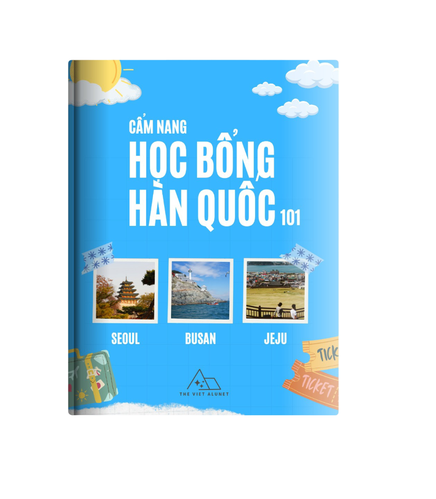

# 🎓 Học bổng Hàn Quốc 101 – Cẩm nang du học dành cho người Việt

<p align="center">
  <a href="assets/img/home1-img.png">
    
  </a>
</p>

**“Học bổng Hàn Quốc 101”** là cuốn sách điện tử (Jupyter Book) được biên soạn bởi **The Viet ALUNET** – cộng đồng cựu sinh viên và sinh viên Việt Nam tại Hàn Quốc và các trường đại học uy tín trong nước.

Cuốn sách nhằm cung cấp thông tin toàn diện, chiến lược nộp hồ sơ và kinh nghiệm thực tiễn để giúp bạn từng bước chinh phục học bổng du học Hàn Quốc.

---

## 🧭 Cuốn sách này dành cho ai?

- Học sinh – sinh viên có dự định săn học bổng đi Hàn Quốc.
- Những người đang trong quá trình chuẩn bị hồ sơ.
- Phụ huynh muốn tìm hiểu lộ trình học bổng cho con em.
- Cựu sinh viên muốn chia sẻ kinh nghiệm và đồng hành cùng thế hệ tiếp theo.

---

## 📘 Nội dung nổi bật

- **Tổng quan học bổng Hàn Quốc**  
  Bao gồm GKS, học bổng trường, học bổng nghiên cứu, từ doanh nghiệp...

- **Chiến lược chọn học bổng phù hợp**  
  Cách tìm nguồn thông tin, xác định tiêu chí chọn lọc, liên hệ hiệu quả.

- **Chuẩn bị hồ sơ mạnh mẽ**  
  Gồm bảng điểm, thành tích ngoại khóa, thư giới thiệu, kế hoạch học tập...

- **Rải hồ sơ và phỏng vấn**  
  Tránh bỏ trùng, viết email đúng cách, tâm lý khi phỏng vấn và thư cảm ơn.

- **Hành trang trước khi sang Hàn**  
  Giấy tờ, visa, hợp pháp hóa, nên mang theo gì, và chuẩn bị tinh thần.

- **📌 Case Studies**  
  Những câu chuyện thực tế từ người đã nhận học bổng tại SNU, Yonsei, Korea, SKKU, Ewha...

---

## 🛠 Công nghệ

Sách sử dụng [**Jupyter Book**](https://jupyterbook.org/) – nền tảng mở cho phép:
- Dễ dàng đọc online hoặc offline.
- Tìm kiếm, tra cứu linh hoạt.
- Dễ dàng đóng góp nội dung qua GitHub.

---

## 🧑‍💼 Đóng góp cùng chúng tôi

Bạn đã từng đạt học bổng Hàn Quốc?  
Bạn đang trên hành trình chuẩn bị và muốn giúp người sau?

Chúng tôi luôn chào đón:
- Case study của bạn
- Bí kíp săn học bổng (từ học thuật đến tâm lý)
- Hướng dẫn viết email, SOP, thư giới thiệu...

📬 Gửi đóng góp về: [thevietalunet@gmail.com](mailto:thevietalunet@gmail.com)

---

## 🌐 Về The Viet ALUNET

> **Kết nối tri thức Việt toàn cầu**

**The Viet ALUNET** là mạng lưới của cựu sinh viên – sinh viên người Việt từ các trường đại học hàng đầu (FTU, NEU, UET, HUST, HANU, ULIS...) đang học tập và làm việc tại Hàn Quốc, cũng như khắp nơi trên thế giới.

Website: [https://thevietalunet.wixsite.com/home](https://thevietalunet.wixsite.com/home)

---

## 📄 Giấy phép

Nội dung sách phát hành dưới giấy phép [**Creative Commons Attribution 4.0**](https://creativecommons.org/licenses/by/4.0/)

---

## 🛠 Cách build sách

```bash
# Cài đặt jupyter-book
pip install -U jupyter-book

# Build sách
jupyter-book build hoc-bong-han-quoc-101/

# Mở HTML tại _build/html/index.html
